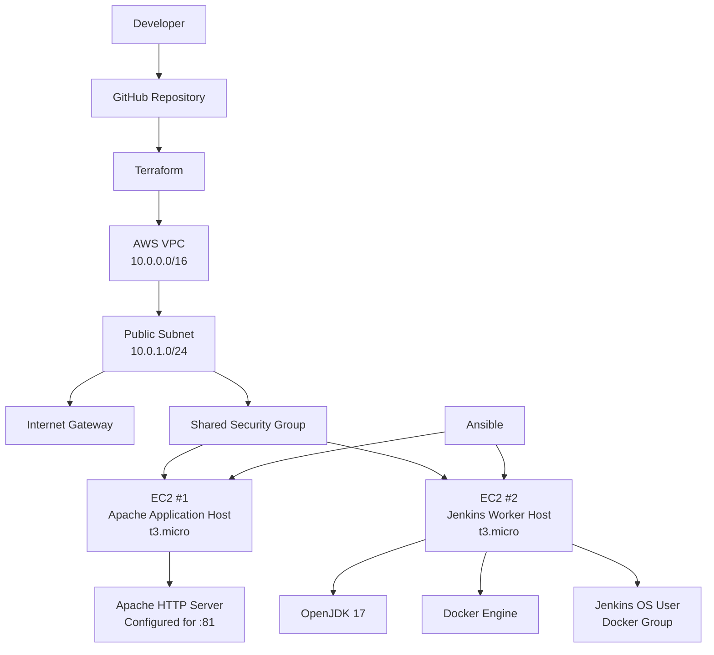

# Infrastructure Automation — Terraform + Ansible on AWS

[](https://aws.amazon.com/)
[](https://developer.hashicorp.com/terraform)
[](https://www.ansible.com/)
[](https://www.docker.com/)
[](https://www.jenkins.io/)

> A hands-on DevOps infrastructure project that provisions AWS compute and networking with Terraform, then configures the resulting EC2 hosts with Ansible roles for Apache and Jenkins-worker prerequisites.

This repository contains the infrastructure and configuration-management layer associated with **DevOps Assignments 05 and 06**. It is designed as a practical lab showing how Infrastructure as Code (IaC) and configuration automation can replace repetitive manual EC2 setup.

---

## Table of Contents

* [Project Overview](#project-overview)
* [Current Repository Scope](#current-repository-scope)
* [Architecture](#architecture)
* [What the Project Automates](#what-the-project-automates)
* [Technology Stack](#technology-stack)
* [Repository Structure](#repository-structure)
* [Terraform Infrastructure](#terraform-infrastructure)
* [Ansible Configuration](#ansible-configuration)
* [Prerequisites](#prerequisites)
* [Quick Start](#quick-start)
* [Step 1 — Configure AWS Credentials](#step-1--configure-aws-credentials)
* [Step 2 — Provision AWS Infrastructure](#step-2--provision-aws-infrastructure)
* [Step 3 — Configure the Ansible Inventory](#step-3--configure-the-ansible-inventory)
* [Step 4 — Validate Ansible Connectivity](#step-4--validate-ansible-connectivity)
* [Step 5 — Run the Ansible Site Playbook](#step-5--run-the-ansible-site-playbook)
* [Verification](#verification)
* [Cleanup](#cleanup)
* [Security Considerations](#security-considerations)
* [Troubleshooting](#troubleshooting)
* [Production Hardening Roadmap](#production-hardening-roadmap)
* [Engineering Notes](#engineering-notes)
* [Contributing](#contributing)
* [License](#license)
* [Maintainer](#maintainer)

---

## Project Overview

The repository demonstrates a two-stage infrastructure workflow:

1. **Terraform provisions AWS infrastructure** — VPC, subnet, internet gateway, route table, security group, and two EC2 instances.
2. **Ansible configures the EC2 instances** — one host is configured for Apache on port `81`; another is prepared with Java 17 and Docker for use as a Jenkins worker node.

The separation of responsibilities is intentional:

| Layer                   | Responsibility                                   | Tool         |
| ----------------------- | ------------------------------------------------ | ------------ |
| Cloud infrastructure    | Networks, routing, security group, EC2 instances | Terraform    |
| Host configuration      | Packages, services, ports, OS-level setup        | Ansible      |
| Application/web tier    | Apache web service on the application host       | Ansible role |
| CI worker prerequisites | OpenJDK 17 + Docker Engine                       | Ansible role |
| Source control          | Versioned infrastructure and automation code     | Git / GitHub |

This creates a repeatable workflow in which infrastructure is declared as code and server configuration is applied through automation rather than a long sequence of manual console and SSH operations.

---

## Current Repository Scope

The README that previously existed in this repository described a React application, a Dockerfile, and a `terraform/` directory. The **current `main` branch no longer contains those paths**.

The live repository currently centers on:

* `ansible/` — configuration management and host roles
* `terrafrom/` — Terraform AWS infrastructure definitions
* `.github/ISSUE_TEMPLATE/` — GitHub issue templates
* `.gitignore` — exclusion rules for Terraform state, environment files, keys, logs, and local tooling

The Terraform directory is currently spelled **`terrafrom/`** in the repository. It is referenced exactly as it exists so the documented commands work against the current tree.

### Current-state boundary

This repository currently **does**:

* Provision a custom AWS VPC and subnet.
* Create an internet gateway and default route.
* Create a shared security group.
* Launch two `t3.micro` EC2 instances.
* Output the public IP addresses of both instances.
* Configure Apache on one host to use port `81` at the configuration-file level.
* Allow port `81` through UFW on that host.
* Install OpenJDK 17 and Docker on the Jenkins worker host.
* Start and enable Docker on the Jenkins worker host.
* Add an existing `jenkins` OS user to the Docker group.

This repository currently **does not** contain:

* The React application source previously referenced by the older README.
* A Dockerfile for the React application.
* A Jenkins controller installation.
* A Jenkinsfile or Jenkins pipeline definition.
* Automated registration of the worker with a Jenkins controller.
* A production-grade load balancer, database, NAT gateway, autoscaling group, or managed Kubernetes environment.

Keeping this boundary explicit prevents the README from claiming capabilities that are not represented in the current source tree.

---

## Architecture



### Deployment model

```text
Terraform
   │
   ├── VPC
   ├── Subnet
   ├── Internet Gateway
   ├── Route Table
   ├── Security Group
   ├── EC2: Apache/Application Host
   └── EC2: Jenkins Worker Host
             │
             ▼
          Outputs
     public IP addresses
             │
             ▼
        Ansible Inventory
             │
             ▼
        ansible/site.yml
          │          │
          │          └── jenkins_worker_node
          │               ├── OpenJDK 17
          │               ├── Docker
          │               ├── Docker service
          │               └── jenkins → docker group
          │
          └── anginix_docker_ec2
               ├── Apache
               ├── Listen 81
               ├── VirtualHost :81
               └── UFW allow tcp/81
```

---

## What the Project Automates

### 1. Infrastructure as Code

Terraform defines the AWS environment in a single declarative configuration. Instead of manually creating a VPC, subnet, route table, security group, and EC2 instances through the AWS Console, the desired state is represented in version-controlled code.

### 2. Repeatable host configuration

Ansible separates host configuration from infrastructure provisioning. Once the EC2 instances exist, the playbook applies role-specific configuration to each host.

### 3. Role-based Ansible design

The Ansible configuration uses two roles:

* `anginix_docker_ec2`
* `jenkins_worker_node`

The role structure makes it possible to evolve host configuration independently without placing every task in one large playbook.

### 4. Jenkins worker preparation

The Jenkins worker role installs the runtime dependencies required by a Jenkins build node:

* OpenJDK 17
* Docker Engine (`docker.io`)
* Running and enabled Docker service
* Existing `jenkins` user added to the Docker group

The role is intentionally a **worker preparation layer**; it does not install Jenkins itself or connect the machine to a Jenkins controller.

---

## Technology Stack

| Technology             | Purpose                                                              |
| ---------------------- | -------------------------------------------------------------------- |
| **AWS**                | Cloud platform for networking and EC2 compute                        |
| **Terraform**          | Declarative AWS Infrastructure as Code                               |
| **Ansible**            | Configuration management and repeatable host provisioning            |
| **Apache HTTP Server** | Web server configured for port `81`                                  |
| **OpenJDK 17**         | Java runtime required by the Jenkins worker environment              |
| **Docker Engine**      | Container runtime on the Jenkins worker                              |
| **Jenkins**            | CI/CD worker target; this repository prepares the host prerequisites |
| **Git / GitHub**       | Version control and collaboration                                    |

---

## Repository Structure

```text
infra0506/
├── .github/
│   └── ISSUE_TEMPLATE/
│       ├── bug_report.md
│       └── feature_request.md
│
├── ansible/
│   ├── ansible.cfg
│   ├── inventory.ini
│   ├── site.yml
│   └── roles/
│       ├── anginix_docker_ec2/
│       │   └── tasks/
│       │       └── main.yml
│       │
│       └── jenkins_worker_node/
│           └── tasks/
│               └── main.yml
│
├── terrafrom/
│   └── main.tf
│
├── .gitignore
└── README.md
```

> **Note:** The directory name `terrafrom/` is the spelling currently present in the repository. Renaming it to `terraform/` would be a cleanup improvement, but the commands below intentionally use the existing path.

---

# Terraform Infrastructure

## AWS Region

The Terraform provider is configured for:

```text
ap-south-1
```

That means the AMI and EC2 key pair used by this configuration must be valid in the same AWS region.

## Network Resources

Terraform currently defines the following network topology:

| Resource         | Configuration                                |
| ---------------- | -------------------------------------------- |
| VPC              | `10.0.0.0/16`                                |
| Subnet           | `10.0.1.0/24`                                |
| Internet Gateway | Attached to the VPC                          |
| Route table      | Default route `0.0.0.0/0` → Internet Gateway |
| EC2 addressing   | Public IPs enabled                           |

The subnet is effectively used as a public subnet because the route table sends default traffic to the internet gateway and both EC2 instances explicitly request public IP addresses.

## EC2 Resources

### Apache / Application Host

Terraform creates an EC2 instance named:

```text
Apache_and_Docker_Application_Live
```

Current configuration:

* Instance type: `t3.micro`
* Public IP: enabled
* SSH user expected by the inventory: `ubuntu`
* Intended role: Apache/application host
* Terraform output: `public_ip_apache_docker`

### Jenkins Worker Node

Terraform creates a second EC2 instance named:

```text
Jenkins_Worker_Node
```

Current configuration:

* Instance type: `t3.micro`
* Public IP: enabled
* SSH user expected by the inventory: `ubuntu`
* Intended role: Jenkins worker environment
* Terraform output: `public_ip_jenkins_worker`

## Security Group

The current shared security group defines:

|   Port | Protocol | Source       | Purpose                        |
| -----: | -------- | ------------ | ------------------------------ |
|   `22` | TCP      | `0.0.0.0/0`  | SSH                            |
|   `81` | TCP      | `0.0.0.0/24` | Apache                         |
| `8081` | TCP      | `0.0.0.0/24` | Application / container access |
|    All | All      | `0.0.0.0/0`  | Outbound traffic               |

These values are appropriate only as a **lab starting point**. In a hardened deployment, SSH should normally be limited to an administrator's trusted source CIDR, and application ports should be exposed only to the networks or services that actually need access.

> **Important:** `0.0.0.0/24` is not equivalent to “the whole Internet”. These rules should be replaced with the actual client or network CIDRs required by the deployment.

## Terraform Variable

The configuration expects one input variable:

```hcl
variable "key_name" {
  description = "The name of the key pair to use for the instances"
  type        = string
}
```

No default is defined. Supply the AWS EC2 key-pair name at plan/apply time or through the `TF_VAR_key_name` environment variable.

## Terraform Outputs

After a successful apply:

```bash
terraform output
```

The configuration exposes:

```text
public_ip_apache_docker
public_ip_jenkins_worker
```

---

# Ansible Configuration

The Ansible entry point is:

```text
ansible/site.yml
```

The playbook targets two host groups and applies one role to each.

## Play 1 — Apache/Application Host

```yaml
- name: Configure Apache + Docker application server
  hosts: anginix_docker_ec2
  become: yes
  roles:
    - anginix_docker_ec2
```

The role currently performs these tasks:

1. Installs `apache2` using APT.
2. Changes Apache's `Listen` directive from port `80` to `81`.
3. Changes the default virtual host from `*:80` to `*:81`.
4. Allows TCP port `81` through UFW.

### Role naming note

The role is named `anginix_docker_ec2`, but its current `tasks/main.yml` only contains Apache and firewall configuration. The name should be treated as the existing role identifier rather than as proof that Docker is configured by this role.

### Operational note

The current role modifies Apache configuration files but does **not** explicitly restart or reload the Apache service after those changes. A production-quality role should normally use an Ansible handler such as `Restart Apache` and trigger it only when the configuration changes.

---

## Play 2 — Jenkins Worker Host

```yaml
- name: Configure Jenkins worker node
  hosts: jenkins_worker_node
  become: yes
  roles:
    - jenkins_worker_node
```

The worker role currently:

1. Installs OpenJDK 17.
2. Installs Docker Engine using the distribution package `docker.io`.
3. Starts Docker.
4. Enables Docker at boot.
5. Adds the `jenkins` operating-system user to the `docker` group.

### Jenkins dependency note

The role assumes that a `jenkins` OS user already exists. It does not create the user and it does not install Jenkins or configure the Jenkins controller/agent connection.

---

## Ansible Configuration File

The current `ansible/ansible.cfg` contains:

```ini
[defaults]
host_key_checking = False
```

This disables SSH host-key checking. It can simplify a lab environment, but it weakens SSH trust verification and should not be used blindly in a production setup.

The configuration does **not** explicitly set `inventory = inventory.ini`, so commands should pass the inventory path explicitly:

```bash
ansible -i inventory.ini all -m ping
ansible-playbook -i inventory.ini site.yml
```

---

# Prerequisites

Install or have access to:

* An AWS account with permission to create VPC, networking, security-group, and EC2 resources.
* Terraform.
* Ansible.
* OpenSSH client.
* An existing EC2 key pair in `ap-south-1`.
* AWS credentials configured through the AWS CLI environment, profile, or environment variables.
* Network access to the EC2 public IP addresses on the ports required for the lab.

Verify the main tools:

```bash
terraform version
ansible --version
aws --version
ssh -V
```

---

# Quick Start

The complete workflow is:

```text
Clone repository
     │
     ▼
Configure AWS credentials
     │
     ▼
terraform init
     │
     ▼
terraform validate
     │
     ▼
terraform plan
     │
     ▼
terraform apply
     │
     ▼
Read Terraform public IP outputs
     │
     ▼
Update ansible/inventory.ini
     │
     ▼
ansible -i inventory.ini all -m ping
     │
     ▼
ansible-playbook -i inventory.ini site.yml
     │
     ▼
Verify Apache + Docker/JDK worker prerequisites
```

---

# Step 1 — Configure AWS Credentials

Use your normal AWS authentication method. For local development, one common approach is:

```bash
aws configure
```

Verify the active identity before creating resources:

```bash
aws sts get-caller-identity
```

Make sure the selected profile/credentials are authorized to operate in:

```text
ap-south-1
```

---

# Step 2 — Provision AWS Infrastructure

Clone the repository:

```bash
git clone https://github.com/doingsomethingsecret/infra0506.git
cd infra0506
```

Enter the Terraform directory using the current repository spelling:

```bash
cd terrafrom
```

Initialize Terraform:

```bash
terraform init
```

Format and validate:

```bash
terraform fmt
terraform validate
```

Create a plan:

```bash
terraform plan -var='key_name=YOUR_EC2_KEYPAIR_NAME'
```

Review the plan carefully, then apply it:

```bash
terraform apply -var='key_name=YOUR_EC2_KEYPAIR_NAME'
```

Terraform will request confirmation before creating the infrastructure.

### Retrieve the resulting IPs

```bash
terraform output
```

Or retrieve them individually:

```bash
terraform output -raw public_ip_apache_docker
terraform output -raw public_ip_jenkins_worker
```

Record both addresses. They are needed by Ansible.

---

# Step 3 — Configure the Ansible Inventory

Move to the Ansible directory:

```bash
cd ../ansible
```

The inventory should contain two important host groups:

```ini
[anginix_docker_ec2]
<APACHE_PUBLIC_IP> ansible_user=ubuntu ansible_ssh_private_key_file=/absolute/path/to/key.pem

[jenkins_worker_node]
<JENKINS_WORKER_PUBLIC_IP> ansible_user=ubuntu ansible_ssh_private_key_file=/absolute/path/to/key.pem
```

The repository also contains a localhost group for local execution contexts:

```ini
[localhost]
localhost ansible_connection=local
```

### Security requirement

Do not commit personal SSH key paths, private keys, passwords, cloud credentials, or other secrets to a public repository.

A safer pattern is to keep a local inventory file outside version control, use an ignored inventory such as `inventory.local.ini`, or inject host/key values through a deployment system.

---

# Step 4 — Validate Ansible Connectivity

Run an Ansible ping against the explicit inventory:

```bash
ansible -i inventory.ini all -m ping
```

Expected successful output resembles:

```text
<host> | SUCCESS => {
    "changed": false,
    "ping": "pong"
}
```

If a host is unreachable, validate SSH manually first:

```bash
ssh -i /absolute/path/to/key.pem ubuntu@<PUBLIC_IP>
```

Do not proceed to the full playbook until SSH access is working.

---

# Step 5 — Run the Ansible Site Playbook

Apply all configured roles:

```bash
ansible-playbook -i inventory.ini site.yml
```

Ansible will then:

* configure the Apache host through `anginix_docker_ec2`;
* prepare the Jenkins worker through `jenkins_worker_node`.

For a dry-run style check, use Ansible check mode where appropriate:

```bash
ansible-playbook -i inventory.ini site.yml --check
```

---

# Verification

## Verify the Apache host

First verify the configuration file values:

```bash
ssh -i /absolute/path/to/key.pem ubuntu@<APACHE_PUBLIC_IP> \
  'sudo grep -E "^Listen|<VirtualHost" /etc/apache2/ports.conf /etc/apache2/sites-available/000-default.conf'
```

Then inspect listening sockets:

```bash
ssh -i /absolute/path/to/key.pem ubuntu@<APACHE_PUBLIC_IP> \
  'sudo ss -lntp | grep -E ":81\b|:80\b" || true'
```

Because the current role does not include an Apache restart/reload task, restart Apache manually after provisioning when required:

```bash
ssh -i /absolute/path/to/key.pem ubuntu@<APACHE_PUBLIC_IP> \
  'sudo systemctl restart apache2 && sudo systemctl status apache2 --no-pager'
```

Then test from your machine:

```bash
curl -I http://<APACHE_PUBLIC_IP>:81
```

> The current security-group rule for port `81` is `0.0.0.0/24`, so external access depends on the source address matching that CIDR. For a lab intended to be reachable from a normal Internet client, update the rule to the actual trusted source network.

## Verify the Jenkins worker prerequisites

Check Java:

```bash
ssh -i /absolute/path/to/key.pem ubuntu@<JENKINS_WORKER_PUBLIC_IP> \
  'java -version'
```

Check Docker:

```bash
ssh -i /absolute/path/to/key.pem ubuntu@<JENKINS_WORKER_PUBLIC_IP> \
  'docker --version && sudo systemctl is-active docker && sudo systemctl is-enabled docker'
```

Check the Jenkins user and group membership:

```bash
ssh -i /absolute/path/to/key.pem ubuntu@<JENKINS_WORKER_PUBLIC_IP> \
  'id jenkins && getent group docker'
```

The expected state is:

* Java 17 is installed.
* Docker is installed.
* Docker is running.
* Docker is enabled at boot.
* The existing `jenkins` user belongs to the `docker` group.

A new login session may be required before a group membership change is reflected in a user's process environment.

---

# Cleanup

AWS resources created by Terraform should be destroyed when the lab is complete to prevent unnecessary cloud costs.

From the Terraform directory:

```bash
cd terrafrom
terraform destroy -var='key_name=YOUR_EC2_KEYPAIR_NAME'
```

Review the destruction plan and confirm only the intended resources are removed.

Afterwards:

```bash
terraform show
terraform output
```

The outputs should no longer represent active instances after successful destruction.

---

# Security Considerations

This is a **learning/lab-oriented infrastructure project**, not a production-hardened AWS landing zone. Before exposing it to real workloads, address the following areas.

## 1. SSH exposure

The security group currently permits TCP/22 from `0.0.0.0/0`.

Recommended production approach:

```text
0.0.0.0/0
   │
   └── avoid for SSH

Trusted admin CIDR
   │
   └── TCP/22 only
```

An even stronger architecture would avoid public SSH altogether and use AWS Systems Manager Session Manager or a controlled bastion/access layer.

## 2. SSH host-key verification

`host_key_checking = False` removes an important SSH trust check. For production automation, keep host-key verification enabled and manage known hosts explicitly.

## 3. Public inventory data

The current inventory contains host addresses and a local private-key filesystem path. These values should not be hard-coded in a public repository.

Use:

* environment-specific inventories;
* inventory templates;
* CI/CD secret stores;
* Ansible Vault where appropriate; or
* dynamic inventory mechanisms.

## 4. Private-key handling

The `.gitignore` correctly ignores common private-key extensions and SSH private-key naming patterns. Nevertheless, `.gitignore` is not a substitute for secret rotation.

If a real private key was ever committed to Git history, revoke/rotate that key pair and remove the secret from history as appropriate.

## 5. Security-group CIDRs

The `81` and `8081` ingress entries use `0.0.0.0/24`, which is unusually narrow and is not the same as allowing all IPv4 addresses. Replace these rules with the actual source CIDRs needed by the application, Jenkins environment, or test client.

## 6. Terraform state

The repository intentionally ignores Terraform state files. State can contain infrastructure details and, depending on configuration, sensitive values.

For a team or production workflow, use a protected remote backend with controlled access, versioning, encryption, and state locking appropriate to the backend design.

---

# Troubleshooting

## `No inventory was parsed` / `No hosts matched`

Use the inventory explicitly:

```bash
ansible -i inventory.ini all -m ping
ansible-playbook -i inventory.ini site.yml
```

The current `ansible.cfg` disables host-key checking but does not explicitly set the inventory path.

## SSH connection fails

Check all of the following:

```bash
ssh -i /absolute/path/to/key.pem ubuntu@<PUBLIC_IP>
```

Verify:

* the EC2 instance is running;
* the public IP is current;
* the correct AWS key pair was used;
* the local key file has appropriate permissions;
* port `22` is reachable;
* `ansible_user=ubuntu` matches the AMI's configured login user.

For the local key file:

```bash
chmod 600 /absolute/path/to/key.pem
```

## Apache still answers on port 80

The role changes Apache configuration files but does not explicitly restart/reload the service.

Inspect:

```bash
sudo ss -lntp | grep apache
```

Then restart:

```bash
sudo systemctl restart apache2
```

A better long-term fix is to add an Ansible handler so the service is restarted only when the configuration changes.

## `jenkins` user does not exist

The worker role contains:

```yaml
- name: Adding the Jenkins user to the Docker group
  user:
    name: jenkins
    groups: docker
    append: yes
```

This assumes the OS user already exists. The current role does not install Jenkins or create the user.

Resolve the dependency by ensuring the Jenkins user exists before the role runs, or evolve the role so the required user/agent installation is managed explicitly.

## Terraform cannot find the AMI

The Terraform configuration uses a fixed AMI ID. AMI identifiers are region-specific and can be retired or replaced.

If changing regions, update the AMI and verify that the SSH username and architecture match the selected image.

## Port 81 / 8081 is inaccessible

Inspect the Terraform security-group source CIDRs. The current entries are:

```text
81   -> 0.0.0.0/24
8081 -> 0.0.0.0/24
```

Use a source CIDR that actually represents the intended client or network. Do not widen access beyond what the lab requires.

## Terraform plan asks for `key_name`

This is expected. The variable has no default value.

Provide it directly:

```bash
terraform plan -var='key_name=YOUR_EC2_KEYPAIR_NAME'
```

Or export it:

```bash
export TF_VAR_key_name='YOUR_EC2_KEYPAIR_NAME'
terraform plan
```

---

# Production Hardening Roadmap

The current project provides a useful foundation for learning Terraform and Ansible. A production-oriented evolution could include:

### Terraform improvements

* Add explicit `required_providers` and Terraform version constraints.
* Replace the hard-coded AMI with a data source or a controlled AMI variable.
* Move environment-specific values into variables.
* Add separate security groups per workload instead of one shared group.
* Restrict SSH ingress to trusted CIDRs or remove public SSH entirely.
* Add encrypted remote Terraform state and state locking.
* Add lifecycle and tagging conventions.
* Split networking and compute into reusable Terraform modules.
* Introduce multiple environments such as `dev`, `staging`, and `prod`.

### Ansible improvements

* Define the inventory explicitly in `ansible.cfg` or use dynamic inventory.
* Add handlers to restart/reload Apache after configuration changes.
* Make the Jenkins user prerequisite explicit.
* Manage Jenkins agent installation and registration if worker automation is required.
* Add idempotent configuration for Docker and Apache.
* Parameterize ports instead of hard-coding them.
* Add `ansible-lint` and YAML validation to CI.
* Use Ansible Vault or an external secrets manager for sensitive configuration.

### AWS security improvements

* Prefer private subnets for worker/internal systems.
* Use public load-balanced application access rather than exposing EC2 directly where appropriate.
* Use IAM roles instead of long-lived AWS access keys on servers.
* Use Systems Manager Session Manager for administration where feasible.
* Enable logging and monitoring for security and operational visibility.
* Apply least-privilege security-group rules.
* Add AWS Budget alerts before experimenting with additional resources.

### CI/CD improvements

A mature version of this repository could add a pipeline that automatically runs:

```text
Git push
   │
   ├── Terraform fmt check
   ├── Terraform validate
   ├── Terraform plan
   ├── Ansible syntax check
   ├── Ansible lint
   └── Security scanning
```

Deployment approval could then gate `terraform apply` and production configuration changes.

---

# Engineering Notes

## Why Terraform + Ansible?

Terraform and Ansible solve different layers of the infrastructure lifecycle:

**Terraform answers:**

> “What cloud infrastructure should exist?”

For this project, that includes the VPC, subnet, internet gateway, route table, security group, and EC2 instances.

**Ansible answers:**

> “How should the operating system and services on those machines be configured?”

For this project, that includes Apache configuration and Jenkins-worker prerequisites.

This separation reduces coupling between cloud resource provisioning and operating-system configuration and creates a clear operational workflow.

## Idempotency

Ansible tasks use declarative states such as:

```yaml
state: present
state: started
enabled: yes
```

This allows repeated runs to converge a host toward the intended state instead of requiring a manual sequence of one-off commands.

Terraform similarly maintains a desired infrastructure state through its configuration and state model.

## Infrastructure lifecycle

A clean operational lifecycle for this repository is:

```text
Define
  ↓
Validate
  ↓
Plan
  ↓
Review
  ↓
Apply
  ↓
Configure
  ↓
Verify
  ↓
Operate
  ↓
Destroy / Evolve
```

The workflow is simple enough for a lab while mirroring the basic control flow used in larger infrastructure environments.

---

Recommended workflow:

```bash
git checkout -b feature/<change>
```

Make the change, then validate the infrastructure and configuration before committing:

```bash
terraform fmt -check
terraform validate
ansible-playbook -i ansible/inventory.ini ansible/site.yml --check
```

Commit with a clear message:

```bash
git add .
git commit -m "Improve infrastructure automation"
```

Then open a pull request describing:

* what changed;
* why it changed;
* infrastructure impact;
* security impact;
* validation performed.

The repository includes GitHub issue templates for bug reports and feature requests.

---

# License

No `LICENSE` file is currently present in the repository.

If this project is intended for public reuse, add an explicit open-source license (for example, MIT or Apache-2.0) so that redistribution and modification rights are clearly defined.

Until a license is added, do not assume that the repository's contents are licensed for unrestricted reuse merely because the repository is public.

---

# Maintainer

**Usama Shafiq**

GitHub: [@doingsomethingsecret](https://github.com/doingsomethingsecret)

Repository: [infra0506](https://github.com/doingsomethingsecret/infra0506)

---

## Final Summary

This repository is a practical **Terraform + Ansible AWS infrastructure automation project**. Terraform establishes the cloud foundation, while Ansible applies host-level configuration through reusable roles. The current implementation provisions two EC2 instances: an Apache-oriented application host and a Jenkins-worker preparation host.

The project is intentionally straightforward enough to study, explain in a viva, and extend into a more production-oriented DevOps platform. Its strongest architectural lesson is the separation between **infrastructure provisioning** and **configuration management**, with all major setup logic represented as version-controlled code.
